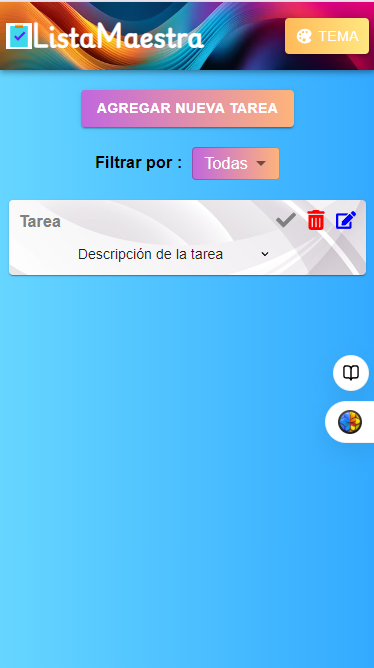
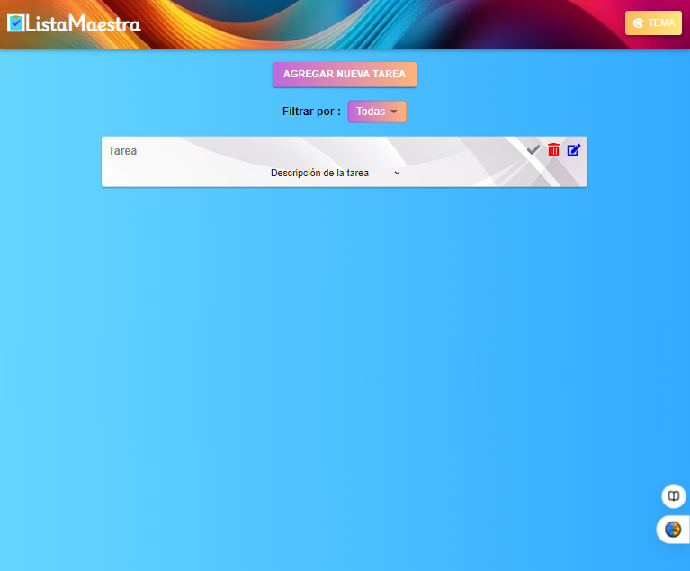
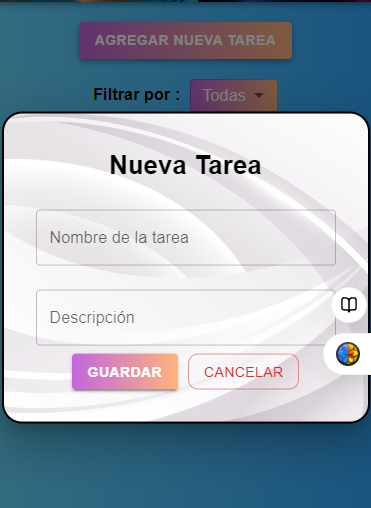
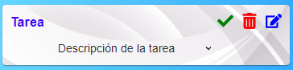
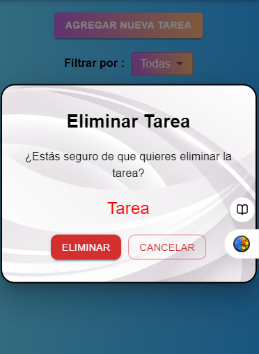
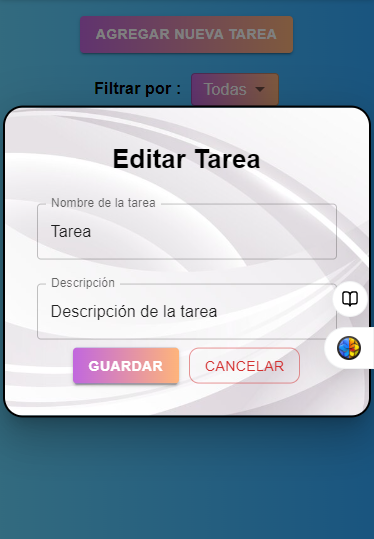

# ListaMaestra

En esta app [ListaMaestra](https://listamaestra.netlify.app) se pueden ingresar tareas a realizar para organizar mejor el día a día. Estas pueden ser editadas, eliminadas y marcadas cuando se complete la tarea. También posee filtros según tarea realizada, no realizada y todas las tareas.

## La vista segun el tamaño:

Modo celular:

Modo desktop:

## El navbar:

Está compuesto por el logo de la app, el nombre de esta y un botón con el cual se puede cambiar el color del fondo de la app.

## Agregar nueva tarea:

La app posee un botón (agregar nueva tarea) el cual al ser tocado se abre una modal para agregar una nueva tarea, con el nombre de la tarea y una descripción (esta última opcional).

## Card de tarea:

La card de la tarea al ser creada tendrá lo siguiente:

- Nombre
- Icono de Check
- Icono de eliminar
- Icono de editar
- Descripción de tarea para abrir y ver la descripcón que le colocamos.

### Icono check:

Al tocar este icono tanto el nombre de la tarea como el icono cambiarán de color a gris dando a entender que la tarea está completada.

- Tarea no completada
  

- Tarea completada
  

## Icono de eliminar:

Al tocar el icono de eliminar se abrirá un modal que preguntará al usuario si está seguro de eliminar la tarea: Nombre de la tarea. Al tocar eliminar se borrará la card de esa tarea.
También la modal tiene el botón de cancelar por si el usuario no deseaba abrir o eliminar esa tarea.

## Icono de editar:

Al tocar el icono de editar se abrirá una modal con los datos de la card precargados para ser editados si se desea.Al tocar el botón Guardar los cambios realizados se guardan y se ven reflejados en la card de la tarea.También posee el botón de cancelar por si el usuario no deseaba editar esa card.

## Filtros:

La app puede filtrar las tareas según las tareas Realizadas, No Realizadas y Todas las tareas. Esto ayuda al usuario para tener en cuenta las tareas que le faltas terminar o cuáles son las que ya terminó.

## Construido Con

Las tecnologías que utilicé para construir este proyecto:

- JavaScript
- React
- Material-UI (MUI)

## Autor

- ** MELIE GALAZ **

## Link para usar la app

https://listamaestra.netlify.app
